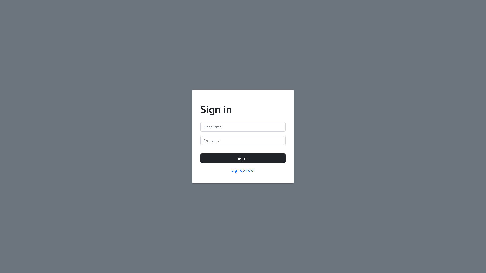
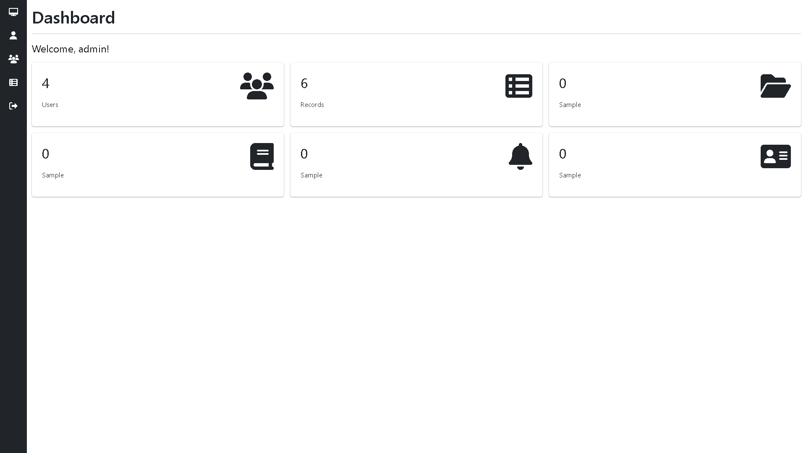
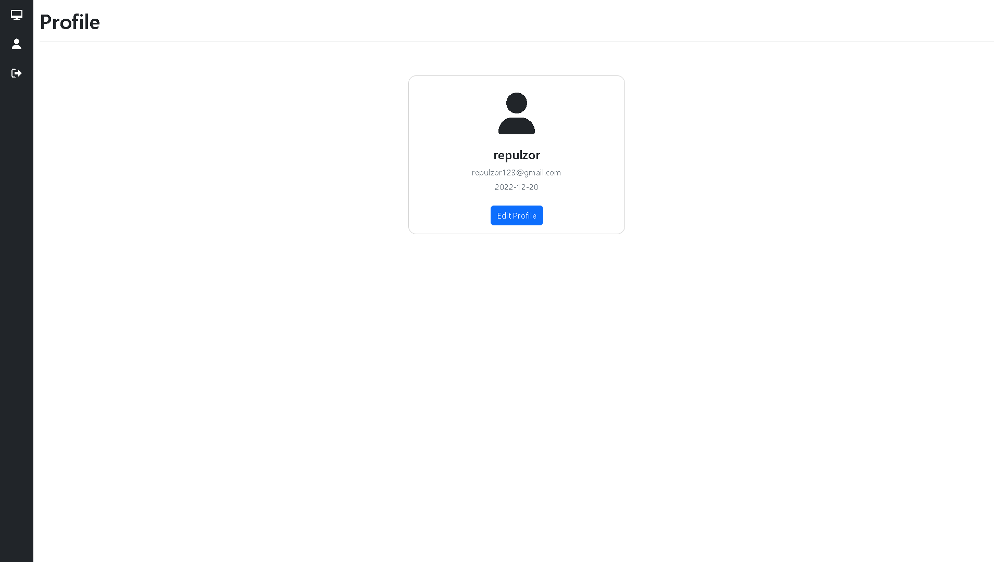
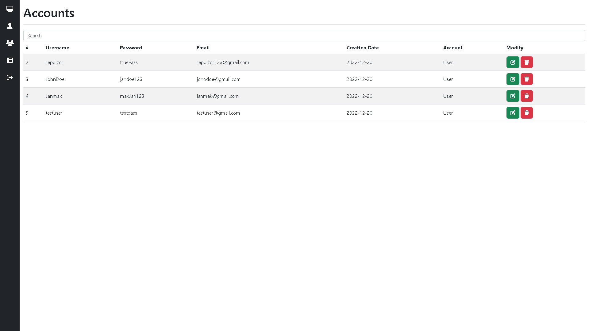
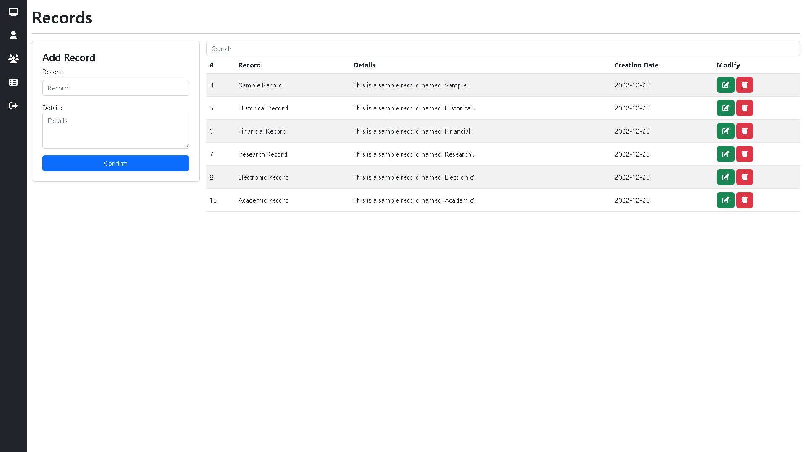

# PHP CRUD with Login Authentication

Easy to use PHP CRUD with login authentication, live search and datatables using AJAX.

## Table of contents

- [Overview](#overview)
  - [Screenshots](#screenshots)
- [Tech Stack](#tech-stack)
  - [Languages](#built-with)
  - [Frameworks/Libraries](#frameworks/libraries)
- [File Structure](#file-structure)
- [Getting Started](#getting-started)
  - [Installing](#installing)
  - [How to use](#how-to-use)
- [Author](#author)
- [Acknowledgments](#acknowledgments)

## Overview
### Screenshots

- Login Page

- Dashboard

- Profile

- Accounts

- Records

## Tech Stack

### Languages
* [![PHP][php.net]][https://www.php.net/]
* [![JavaScript][javascript.com]][https://www.javascript.com/]
* [![CSS][css-tricks.com/]][https://css-tricks.com/]

### Frameworks/Libraries
* [![JQuery][JQuery.com]][https://jquery.com/]
* [![Bootstrap][Bootstrap.com]][https://getbootstrap.com/]

## File Structure

php-ajax-crud-with-login-authentication/ 
├── assets/ 
│   ├── css/ 
│   │   └── style.css 
│   ├── js/ 
│   │   ├── ajax/ 
│   │   │   ├── accounts_data.js 
│   │   │   ├── profile_data.js 
│   │   │   └── records_data.js 
│   │   └── alerts.js 
│   └── php/ 
│       ├── crud/ 
│       │   ├── accounts_crud.php 
│       │   ├── profile_crud.php 
│       │   └── records_crud.php 
│       ├── extensions/ 
│       │   └── sidebar.php 
│       ├── modals/ 
│       │   ├── accounts_modal.php 
│       │   ├── profile_modal.php 
│       │   └── records_modal.php 
│       ├── connection.php 
│       ├── dashboard_counter.php 
│       ├── login.php 
│       ├── login_validation.php 
│       └── logout.php 
├── data/ 
│   ├── database.sql 
│   ├── extra.sql 
│   ├── tb_accounts.sql 
│   └── tb_records.sql 
└── screenshots/ 
    ├── accounts.png 
    ├── dashboard.png 
    ├── index.png 
    ├── profile.png 
    └── records.png

## Getting Started

### Installing

* Source code will be available once purchased

### How to use

* Simply open the source code with preferred IDE
* Start developing your project

## Author

- [Red Pangilinan](https://redpangilinan.github.io/portfolio/)
